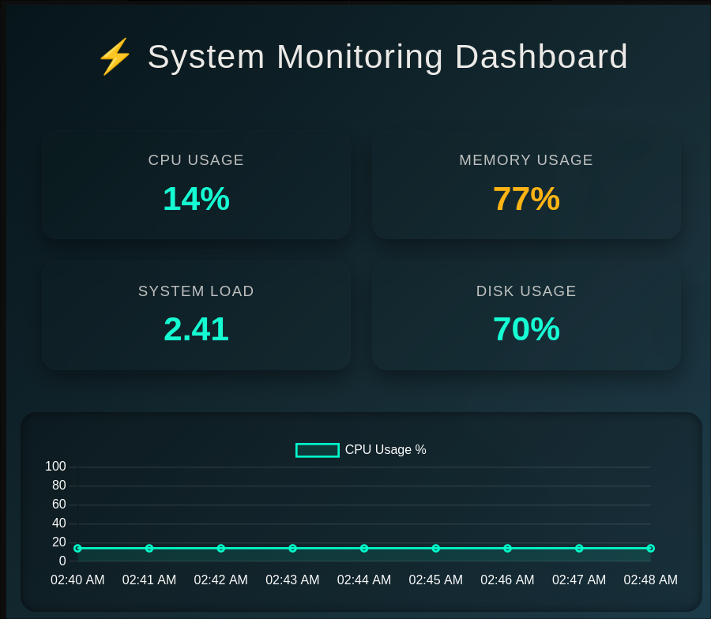

# Linux System Resource Monitor

A lightweight system monitoring tool built specifically for Linux environments. This project circumvents heavy monitoring agents by reading raw hardware states directly from the kernel and visualizing them through a modern, local web interface.

## Core OS Concepts Demonstrated

- **Virtual Filesystems:** Reads directly from `/proc/stat`, `/proc/meminfo`, and `/proc/loadavg` to calculate hardware usage without relying on top-level abstractions.
- **Data Serialization:** Parses unstructured OS output using `awk` and `grep`, formatting it into strict JSON.
- **Asynchronous Polling:** The frontend fetches the `.json` state asynchronously, using cache-busting techniques to ensure real-time data updates without page reloads.

## Project Architecture

- `collector.sh`: The core engine. It calculates a 1-second CPU delta and extracts memory, load average, and root disk usage.
- `dashboard.html`: The UI layer. A responsive, dark-themed dashboard using `Chart.js` to graph CPU trends and dynamically color-code hardware strain.
- `data.json`: The volatile state file containing the latest hardware snapshot.
- `history.log`: A persistent CSV-formatted log tracking system metrics over time.

##  Usage

### 1. Make the script executable
Before running the collector, ensure it has the proper permissions:
\`\`\`bash
chmod +x collector.sh
\`\`\`

### 2. Automate Data Collection (Crontab)
To continuously monitor the system in the background, set up a `cron` job to execute the script automatically. 

Open your crontab editor:
\`\`\`bash
crontab -e
\`\`\`

Add the following line to run the collector every minute (make sure to replace `/path/to/` with your actual absolute path):
\`\`\`bash
* * * * * /path/to/os-projects/system-monitor/collector.sh
\`\`\`

### 3. View the Dashboard
To bypass browser CORS security policies for local files, start a lightweight local web server in the project directory:
\`\`\`bash
python -m http.server 8000
\`\`\`
Then, open your web browser and navigate to `http://localhost:8000/dashboard.html` to view the live, auto-updating metrics.